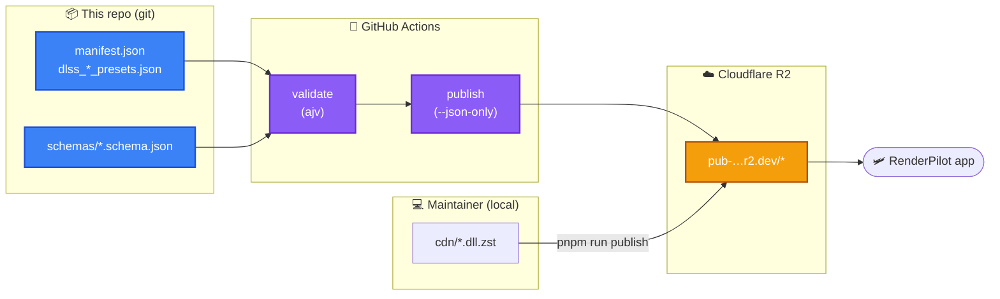

<div align="center">
  <h1>🛩️ RenderPilot Libraries</h1>

  <p><strong>Catalog and CDN backing store for <a href="https://github.com/osyka-yuri/renderpilot">RenderPilot</a> — graphics upscaling libraries (DLSS · FSR · XeSS · Streamline · DirectStorage) and the JSON manifests the app fetches at runtime.</strong></p>

  <div>
    <a href="https://github.com/osyka-yuri/renderpilot-libraries/actions/workflows/publish.yml"></a>
  </div>

  <div style="margin-top: 10px;">
    
    
    
  </div>
</div>

<br />

The **JSON manifests live in git** (the source of truth); the **binaries are stored
zstd-compressed and served from Cloudflare R2**. On every push to `main`, CI validates
every manifest against its JSON Schema and publishes the app-fetched JSON to the bucket.
Binaries are mirrored to R2 by the maintainer with the same Node tooling.

## 🗺️ Pipeline



## 📂 Repository layout

```
.
├── manifest.json                  Library catalog — DLLs → SHA-256 → R2 download URL
├── dlss_presets.json              DLSS Super Resolution render presets per version
├── dlss_g_presets.json            DLSS Frame Generation presets per version
├── dlss_d_presets.json            DLSS Ray Reconstruction presets per version
├── dlss_settings.json             NVAPI DLSS driver-settings catalog (bundled in-app)
├── schemas/                       JSON Schemas (draft 2020-12) for every manifest
├── renodx_manifest.json           RenoDX HDR overrides + catalogue (served; no binaries)
├── renodx_library_manifest/       RenoDX manifest authoring source (generator + wiki inputs)
├── scripts/                       Node tooling — validate.mjs · publish-r2.mjs · catalog.mjs
├── cdn/                           zstd binaries (git-ignored; mirrored to R2)
└── .github/workflows/publish.yml  validate → publish CI
```

## 🌐 Served from R2

Public origin: `https://pub-48612a35034d40f88f42b4181547925a.r2.dev/`

| Object                   | Purpose                                              | Schema                             |
| :----------------------- | :--------------------------------------------------- | :--------------------------------- |
| `manifest.json`          | Library catalog (DLLs + SHA-256 + download URLs)     | `library_catalog.schema.json`      |
| `dlss_presets.json`      | DLSS Super Resolution presets                        | `dlss_preset_manifest.schema.json` |
| `dlss_g_presets.json`    | DLSS Frame Generation presets                        | `dlss_preset_manifest.schema.json` |
| `dlss_d_presets.json`    | DLSS Ray Reconstruction presets                      | `dlss_preset_manifest.schema.json` |
| `renodx_manifest.json`   | RenoDX HDR overrides + catalogue (no binaries)       | `renodx_manifest.schema.json`      |
| `<id>_<version>.dll.zst` | zstd-compressed DLL payloads (one per catalog entry) | —                                  |

> `dlss_settings.json` is **bundled into the app** at compile time, so it is validated
> here (as the source of that bundled copy) but **not** uploaded.

## 🎮 RenoDX manifest (served)

`renodx_manifest.json` (repo root) is the RenoDX HDR **overrides + catalogue** the app fetches
from the R2 root; `renodx_library_manifest/` is its authoring source. Schema:
`schemas/renodx_manifest.schema.json`.

Unlike the library catalogue it carries **no binaries or hashes** — RenoDX add-ons are rolling
per-game snapshots fetched **live from upstream** (`clshortfuse.github.io`, engine-generic repos)
at install time. The manifest only maps game → slug + match rules + per-game overrides, plus the
global ReShade sources, engine generics, and a shared `defaults` block (risk / `min_app_version` /
`channel` the app merges onto every title), so it publishes as plain JSON like the others. A title
only repeats a field when it deviates from those defaults (schema v3).

| File                                            | Purpose                                                                                                              |
| :---------------------------------------------- | :------------------------------------------------------------------------------------------------------------------- |
| `renodx_manifest.json` (root)                   | Generated, served manifest — schema v3 (270 titles + engine generics; per-title boilerplate hoisted into `defaults`) |
| `renodx_library_manifest/generate-manifest.mjs` | Offline generator (`pnpm run generate:renodx`)                                                                       |
| `renodx_library_manifest/enrich-exe.mjs`        | Networked Steam appinfo enrichment for cross-launcher `exe_name` match rules                                         |
| `renodx_library_manifest/appid_exe.json`        | Generated cache: Steam AppID → public Windows launch executable basenames                                            |
| `renodx_library_manifest/wiki_games.json`       | RenoDX wiki Mods snapshot (one row per game)                                                                         |
| `renodx_library_manifest/match_overlay.json`    | Per-title AppIDs / exe / risk / download/category overlay                                                            |
| `renodx_library_manifest/pending_match.json`    | Generated todo-list: wiki rows still lacking a usable AppID or exact exe match                                       |
| `renodx_library_manifest/PUBLISHING.md`         | Authoring & publish flow + the `check:slugs` gate                                                                    |

> `pnpm run check:slugs` is the availability gate — it asserts every snapshot-hosted title's
> `renodx-<slug>.addon*` exists in the upstream `snapshot` release before going live.

## 🧰 Tooling

All tooling is **Node.js** — one toolchain, no platform-specific shells or external binaries.

```bash
pnpm install           # one-time: restore dependencies
pnpm run check         # format, schema, generated output, RenoDX tests, slug gate
node scripts/publish-r2.mjs --dry-run   # preview the upload set (no network, no creds)

# Publish (needs R2 credentials in the environment):
pnpm run publish:json  # JSON manifests only
pnpm run publish       # binaries (cdn/*.dll.zst) + JSON
```

| Script                                   | Purpose                                                                                                                                                              |
| :--------------------------------------- | :------------------------------------------------------------------------------------------------------------------------------------------------------------------- |
| `pnpm run check`                         | Runs the full local/CI gate: Prettier, schema validation, generated-output check, RenoDX tests, and slug availability.                                               |
| `scripts/validate.mjs`                   | Validates every manifest with **ajv** (draft 2020-12).                                                                                                               |
| `scripts/publish-r2.mjs`                 | Uploads to R2 via the **AWS SDK** (S3-compatible); flags `--json-only`, `--dry-run`, `--force`. Skips objects already current (size + MD5) and verifies each upload. |
| `scripts/catalog.mjs`                    | Shared config — the file→schema map, the served set, and R2 coordinates. **Single source of truth** imported by both scripts.                                        |
| `renodx_library_manifest/lib/*.mjs`      | Pure RenoDX authoring helpers used by the generator, enrichment script, and `node:test` coverage.                                                                    |
| `renodx_library_manifest/enrich-exe.mjs` | Refreshes the committed Steam AppID → executable cache used for non-Steam `exe_name` matching.                                                                       |

## 🤖 CI / Deployment

[`.github/workflows/publish.yml`](.github/workflows/publish.yml):

1. **validate** — on every push and PR, runs `pnpm run check`.
2. **publish** — on `main` only, runs `pnpm run publish:json`, pushing the served JSON to R2.
   Binaries are not in git, so CI never uploads them — adding new DLLs is a local `pnpm run publish`.

**One-time setup (maintainer):** add the R2 S3 token as repository **Actions secrets**
`R2_ACCESS_KEY_ID` and `R2_SECRET_ACCESS_KEY` (Settings → Secrets and variables → Actions).
The token only needs object read/write on the bucket. Without them the publish job fails.

## 🧩 Schemas

JSON Schema (draft 2020-12), under `schemas/`:

| Schema                              | Validates                       |
| :---------------------------------- | :------------------------------ |
| `library_catalog.schema.json`       | `manifest.json`                 |
| `dlss_preset_manifest.schema.json`  | the three `dlss_*_presets.json` |
| `dlss_settings_catalog.schema.json` | `dlss_settings.json`            |
| `renodx_manifest.schema.json`       | `renodx_manifest.json`          |

## 📥 Adding a library version

1. zstd-compress the DLL into `cdn/<id>_<version>.dll.zst`.
2. Add its entry to `manifest.json` (`entry_id`, `library`, `version`, `build`, `files.dll`
   hash/size, `files.zst` size + R2 `download_url`, `signature`).
3. `pnpm run validate` to confirm the catalog still matches the schema.
4. `pnpm run publish` to mirror the new binary **and** the manifest to R2 (or push the manifest
   change to `main` and let CI publish the JSON — but the binary still needs a local `pnpm run publish`).

## 🛠️ Supported libraries

| Vendor        | Libraries                                                                           |
| :------------ | :---------------------------------------------------------------------------------- |
| **NVIDIA**    | DLSS Super Resolution · Frame Generation · Ray Reconstruction · Streamline (`sl.*`) |
| **AMD**       | FSR 3.1 (DX12 / Vulkan) · FSR Frame Generation · Loader · Radiance Cache · Denoiser |
| **Intel**     | XeSS · XeSS Frame Generation · XeLL · XeSS DX11                                     |
| **Microsoft** | DirectStorage                                                                       |

## 🔖 Licensing

The vendor DLLs are redistributables owned by NVIDIA / AMD / Intel / Microsoft under their
respective licenses; RenoDX is MIT and ReShade is BSD-3-Clause. The manifests and tooling in
this repository belong to the RenderPilot project — see the
[main repository](https://github.com/osyka-yuri/renderpilot).
