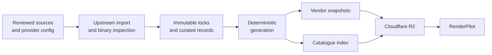

<div align="center">
  

  <h1>RenderPilot Libraries</h1>

  <p><strong>Reviewed, reproducible library and add-on catalogues for RenderPilot.</strong></p>

  <div>
    <a href="https://github.com/osyka-yuri/renderpilot-libraries/actions/workflows/publish.yml"></a>
    
    
  </div>
</div>

<br />

This repository is the catalogue backend for [RenderPilot](https://github.com/osyka-yuri/renderpilot). It tracks reviewed upstream releases, verifies their identities, generates deterministic public manifests, and publishes immutable assets to Cloudflare R2.

Application code lives in the main RenderPilot repository. This repository contains data, schemas, validation, import, and publication tooling.

## ✨ What Lives Here

| Area                 | Contents                                                                                  | Public output                    |
| -------------------- | ----------------------------------------------------------------------------------------- | -------------------------------- |
| Graphics libraries   | NVIDIA, AMD, Intel, Microsoft, and Valve release catalogues                               | `libraries/v1/`                  |
| Rendering add-ons    | Curated RenoDX, Luma Framework, and ReShade manifests                                     | `addons/v1/`                     |
| Presets and settings | NVIDIA DLSS preset and settings data                                                      | Root JSON manifests              |
| Catalogue tooling    | Upstream discovery, PE and Authenticode inspection, validation, generation, and R2 upload | Deterministic content-addressing |

The root `manifest.json` is frozen for legacy clients. Current RenderPilot builds consume the versioned `libraries/v1` and `addons/v1` contracts.

## 🧭 How It Works



Every installable file and legal document is content-addressed. Vendor snapshots are immutable, while `libraries/v1/index.json` is published last and acts as the catalogue commit point. A client therefore sees either the previous complete catalogue or the next complete catalogue—never a partially published update.

## 🚀 Getting Started

### Prerequisites

- [Node.js](https://nodejs.org/) 24.18.0—the exact CI version is pinned in `.node-version`
- [pnpm](https://pnpm.io/installation) 11
- PowerShell 7 and Windows when inspecting PE files or Authenticode signatures

```powershell
pnpm install
pnpm run check
```

`pnpm run check` is the main quality gate. It checks formatting, schemas, generated output, provider locks, unit tests, Wiki synchronization, slugs, and add-on payload layouts.

## 🛠️ Common Workflows

| Goal                                       | Command                            |
| ------------------------------------------ | ---------------------------------- |
| Run the complete quality gate              | `pnpm run check`                   |
| Run the network-free quality gate          | `pnpm run check:offline`           |
| Regenerate the library catalogue           | `pnpm run libraries:generate`      |
| Check Microsoft releases                   | `pnpm run refresh:microsoft:check` |
| Check AMD, Intel, and Valve releases       | `pnpm run refresh:github:check`    |
| Verify Windows PE and signature inspection | `pnpm run test:authenticode`       |
| Verify the public R2 JSON byte for byte    | `pnpm run check:published-json`    |

Refresh, materialization, migration, and publication are intentionally separate operations. See the [operations guide](docs/operations.md) before changing locks or publishing data.

## 🗂️ Repository Map

| Path                  | Role                                                              |
| --------------------- | ----------------------------------------------------------------- |
| `catalogs/libraries/` | Reviewed provider config, immutable locks, and curated overlays   |
| `catalogs/addons/`    | RenoDX, Luma, and ReShade authoring data                          |
| `libraries/v1/`       | Generated library index and local vendor snapshot projections     |
| `addons/v1/`          | Generated add-on manifests consumed by RenderPilot                |
| `schemas/`            | Public and authoring JSON Schemas                                 |
| `scripts/`            | Validation, generation, upstream refresh, and publication tooling |
| `.github/workflows/`  | Scheduled refresh, validation, and R2 publication automation      |

## 📚 Documentation

- [Library catalogue model](docs/library-catalog.md)—providers, identities, signatures, legal documents, and transport
- [Add-on catalogues](docs/addon-catalogs.md)—published contracts, curation rules, and Wiki synchronization
- [Operations and publishing](docs/operations.md)—refresh modes, quality gates, automation, and R2 safety
- [RenoDX publishing notes](catalogs/addons/renodx/PUBLISHING.md)
- [Luma publishing notes](catalogs/addons/luma/PUBLISHING.md)
- [ReShade publishing notes](catalogs/addons/reshade/PUBLISHING.md)

## 🔗 Related

- [RenderPilot](https://github.com/osyka-yuri/renderpilot)—the desktop application and CLI
- [Public library index](https://pub-48612a35034d40f88f42b4181547925a.r2.dev/libraries/v1/index.json)
